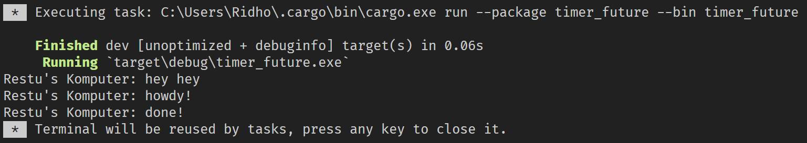
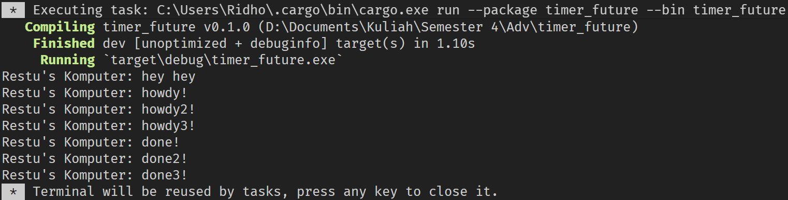
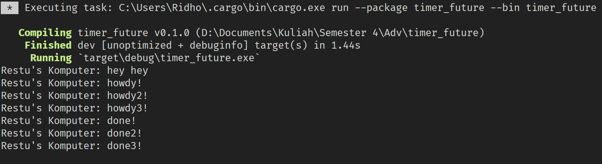

# Tutorial for Advance Programming Course 2023/2024

**Nama** : **Restu Ahmad Ar Ridho**  
**NPM** : **2206028951**  
**Kelas** : **Advance Programming - A**

## Module 10 - Asynchoronous Programming

#### Experiment 1.2: Understanding how it works.

Dalam pemrograman asynchronous, eksekusi kode tidak harus berhenti dan menunggu suatu fungsi selesai sebelum melanjutkan. Ini berarti bahwa fungsi async pada Rust berjalan secara non-blocking. Dalam konteks kode tersebut, fungsi `main` memulai eksekusi dan membuat executor dan spawner. Kemudian, fungsi `main` membuat spawner task async yang mencetak "howdy!", kemudian menunggu selama 2 detik, dan mencetak "done!". Selanjutnya, akan mengeksekusi kode setelahnya yaitu adalah mencetak "hey hey". Kemudian spawner di `drop` untuk memberi tahu tidak ada lagi task yang akan diterima. Kemudian fungsi `main` menjalankan executor, yang akan menjalankan spawner task async yang telah dibuat sebelumnya. Task async tersebut kemudian mencetak "howdy!", kemudian menunggu selama 2 detik, dan kemudian mencetak "done!". Oleh karena itu, "hey hey" dapat dicetak terlebih dahulu sebelum "howdy!" dan "done!", karena `executor.run()` diletakan setelah "hey hey".

#### “Experiment 1.3: Multiple Spawn and removing drop
##### Multiple Spawn

Pada fungsi `main` terdapat instance spawner yang melakukan spawn beberapa task async. Kemudian sama seperti pada Experiment 1.2 program akan menjalankan "hey hey" dan melakukan `drop` spawner untuk memberi tahu tidak ada task lagi yang dibuat dan diterima. Setelah itu, program akan melakukan eksekusi task yang telah dibuat secara berurutan dan eksekusi tidak berhenti menunggu pada satu task saja karena dijalankan secara async sehingga program mencetak "howdy!", "howdy2!", dan "howdy3!". Setelah 2 detik pada makan program akan mencetak "done!", "done2!", dan "done3!" secara berutan hasil dari masing-masing task yang dijalankan.

##### Removing Statement: `drop(spawner);`

Sama seperti pada Multiple Spawn, tetapi program tidak akan pernah berhenti untuk trus berjalan karena program masih menunggu task masih ada.
